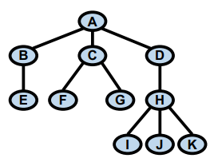
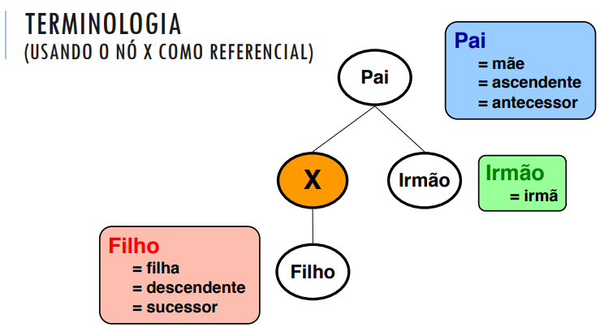
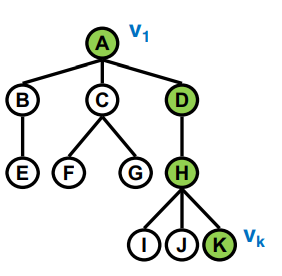

# Árvores
Constituem uma das estruturas mais importantes da área de compuação. São usadas em diversas aplicações.

São formadas por um cojunto de nés que possuem relacionamento de **Hierarquia** ou **Subordinação**.

## Exemplos de Aplicação
- Sistema de arquivos

- Árvore de decisão para jogar tênis

- Árvore de derivação
  - Usada pelos compiladores

## Definição formal
Uma *árvore enraizada T*, ou simplesmente *árvore* é um conjunto finito de zero, ou mais **nós** (**nodos** ou **vértices**), tais que:

Se o número de nós é igual a zero:
- a árvore é dita **vazia**

Se o número de nós é maior que zero:
- existe um nó denominado **raiz** *T(r(T))* da árvore
- os demais nós formam um único conjunto vazio ou são divididos em **m >= 1** conjuntos disjuntos **S1**, **S2**, ..., **Sm**, onde cada um destes é uma árvore (**Si** são denominados **sub-árvores** de _r(T)_)

Se _v_ é um nó de _T_, a notação _T(v)_ indica que a sub-árvore de _T_ com raiz _v_

Se _x_ pertence à sub-árvore _T(v)_:
- _x_ é **descendente** de _v_
- _v_ é **ancestral** de _x_
- Se _x_ é diferente de _v_, _x_ é **descendente próprio** de _v_, e _v_ é **ancestral próprio** de _x_
- Um nó que não possui descendentes próprios é chamado de **folha** ou **terminais**
- Um nó não folha é dito **interior**

Cada nó pode ser associado a um identificador, denominado **rótulo**.

### Grau de um nó
Grau (ou grau de saída) de um nó é a sua quantidade de filhos

### Nível de um nó
O nível de um nó _4_ é o número de nós do caminho da raiz (incluindo a raiz) até o nó _4_

### Altura (Profundidade) de um nó
A altura de um nó *v* é o número de nós do maior caminho de _v_ até um de seus descendentes

### Caminho
Um **caminho** é uma sequência de nós **consecutivo distintos** entre dois nós

### Comprimento do Caminho (K - 1)
É o número de ligações entre os nós do caminho

### Altura dá árvore
é o maior nível dentre seus nós, ou equivalente a altura do nó raiz, nesse exemplo abaixo, a altura da árvore é 4

### Altura vs Nível
Eles são inversas.

### Árvore ordenada
Uma _árvore ordenada_ é aquela na qual os filhos de cada nó estão ordenados. Assume-se que tal ordenação se desenvolva da **esquerda para direita**. A ordem das sub-árvores é relevante.

### Árvore isomorfa
Duas árvores não ordenadas são _isomorfas_ quando puderem se tornar **coincidentes através de permutação na ordem** das sub-árvores de seus nós. Por outro lado, duas árvores ordenadas são _isomorfas_ quando forem **coincidentes**, segundo a ordenação existente entre seus nós.
